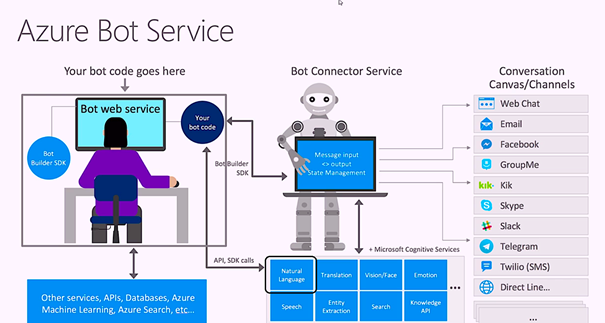
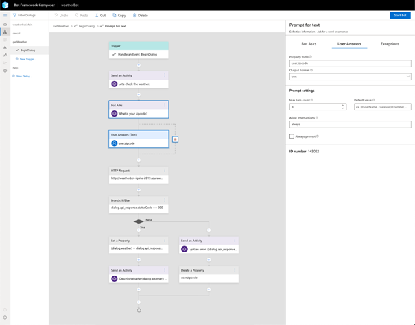
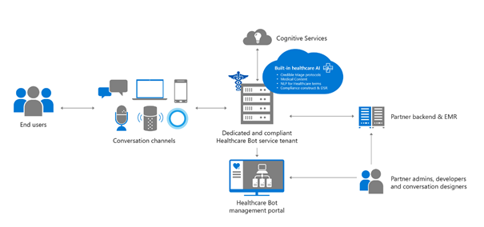
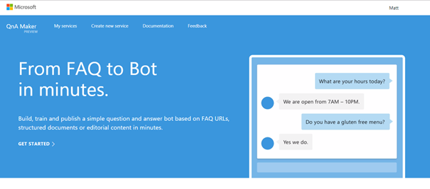
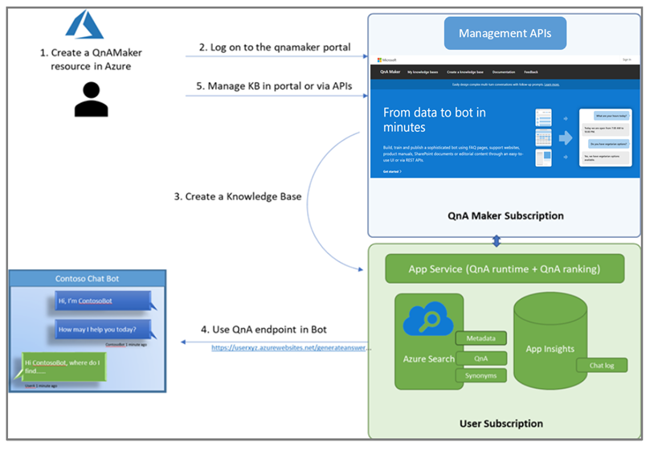
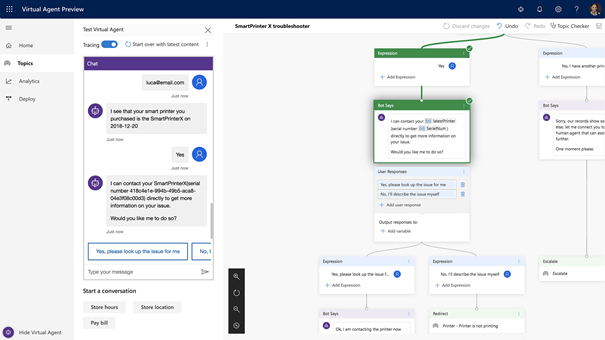

# Understanding the various bot solutions

There are various Microsoft Bot Solutions/Tools available the purpose of this repo is to introduce you to these solutions

1. Microsoft Bot Framework
2. Bot Framework Composer
3. Microsoft Healthcare Bot
4. QnA Maker.
5. Dynamics 365 Virtual Agent

## The Microsoft Bot Framework 

Bot Solutions/Tools.

The Microsoft Bot Framework provide you tools to build, test, deploy, and manage intelligent bots all in one place. Using modular and extensible framework provided by the SDK and Tools, you can leverage .NET or JavaScript to create your Bots.

When you choose this framework, you start with a blank sheet, where you will need a development team to create all the functionality and features for your scenarios.

The Bot Framework can easily integrate with our language understanding service LUIS, to support conversational A.I. You can also easily hook into other A.I. solutions from the Cognitive Services, or anything that is accessible via code.

Because this is built on top of the Bot Connector Service, you can easily make use of different channels such as Web, Teams, SMS, …

The cost for this service is based on your Azure services, such as the Web App and Bot connector Service, to host your bot.

A high-level architectural overview of the Azure Bot Service

More Info: https://docs.microsoft.com/en-us/azure/bot-service

## The Microsoft Bot Composer 

Overview of the Bot Framework Composer.
The Bot Framework Composer is an open source development tool, that is currently in preview. It is based on the Bot Framework and created for developers to build bots and conversational experiences with the Microsoft Bot Framework.

The Most relevant features for these tools are:

A visual editing canvas for conversation flows
In context editing for language understanding (NLU)
Tools to train, test and manage language understanding (NLU) and QnA components
Language generation and templating system
A ready-to-use bot runtime executable
The cost of this service, if you publish this online, will be the hosting costs.

More Info: https://github.com/microsoft/BotFramework-Composer

## Microsoft Health Bot

The Microsoft Health Bot is a cloud-based SaaS (Software As A Service), that combines built-in medical intelligence with natural language capabilities, extensibility tools and compliance constructs. It allows healthcare organizations to quickly and effectively start with their bot journey.

The Health Bot service is SOC, ISO certified and contains a management portal where you can create healthcare use cases and scenarios. The service can connect to your (FHIR) back-ends and is highly configurable, with features such as handoff scenarios, compliance constructs for managing data subject rights, support for localization, orchestration, reporting, and many more. The service requires low code to no code to create your scenarios.

Currently it has built in support for Natural Language Understanding with LUIS, and can link to existing Azure QnA knowledgebases, it can also be easily extended with other NLP or Language models of your choosing

The Microsoft Health Bot is built on top of the Microsoft Bot Connector and can use all the same connectors, channels and integrations as other services.

The cost for this solution is calculated via different plans starting from free (Maximum 3,000 message/month – Up to 10 messages per second), to S5 (Maximum 500,000 messages/month – Up to 25 messages per second)

More Info: https://docs.microsoft.com/en-us/healthbot/

## Microsoft QNA

QnA Maker is a cloud-based Natural Language Processing (NLP) service that easily creates a natural conversational layer over your data. It can be used to find the most appropriate answer for any given natural language input, from your custom knowledge base (KB) of information.
The base for every QnA bot consists out of a knowledge base, this is a set of question and answers, that can be manually entered or automatically extracted from websites, documents, Excels, Pdfs, …

This service is a perfect starting point if you want to start with a FAQ bot, it requires no coding knowledge and has useful features such as follow-up questions, multiple questions for a certain answer and auto learning capabilities.

The QnA maker is built on top of the Microsoft Bot Connector and can use all the same connectors and channels.

QnA Maker backend architecture

The services consist out of different Azure Services, such as Azure Search, Cognitive Services and Web Apps, the cost of this service is based on the SKU of these services.

More Info:  https://docs.microsoft.com/en-us/azure/cognitive-services/qnamaker/

## Dynamics 365 Virtual Agent for Customer Service

Overview of the Virtual Agent workflow

This cloud service has recently been added to the Power Platform family. It plays well with other Power tools such as Power Automate and can be integrated into your PowerApps or Dynamics workloads. There are no coding skills required and can be easily maintained in a visual way.

The service has it own NLU like engine, where you need to provide several questions, that leads to a particular answer, this way or working is similar as with the QnA maker. The bot can also be populated with data from a Website, just as with the QnA Maker.

The cost for this service will be per session.

More Info: https://dynamics.microsoft.com/en-us/ai/virtual-agent-for-customer-service/